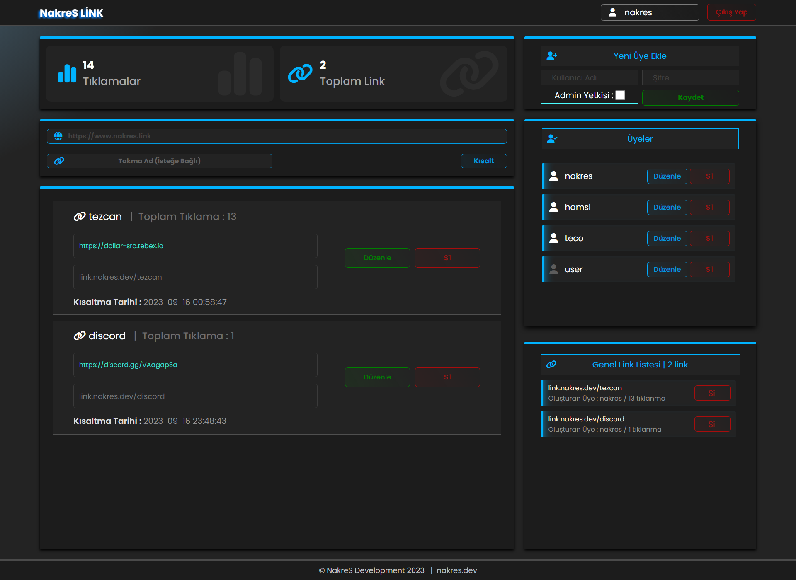

# NakreS URL Shortener:

*DEMO* : https://link.nakres.dev/
- Kullanıcı: user
- Şifre: user123
## Proje Tanıtımı

Bu proje, URL'leri kısaltabilen ve kısaltılan URL'leri yönetebilen bir PHP uygulamasını içerir. Ayrıca, bir üyelik sistemi ve yönetici paneli içerir.



## Özellikler

- **Admin Paneli:**
  - Yönetici kullanıcıları, üye oluşturma, üye yönetme, tüm linkleri silme gibi yetkilere sahiptir.
- **Üye Paneli:**
  - Üyeler kendi linklerini düzenleme, yeni linkler ekleme ve kendi linklerini silme yetkisine sahiptir.
- **Link Kısaltma:**
  - URL'leri kısaltma ve projeye bağlı domain üzerinden yönlendirme yapma.Kısaltılmış linklere tıklanma sayısını görüntüleme.
- **Güvenlik:**
  - Proje, güvenlik önlemleri ile korunur ve kullanıcı girişleri güvenli bir şekilde yönetilir.
  
## Başlangıç

- Bu Projee LOCALHOST / HOSTİNG / VDS /  VPS üzerinde Apache veya ISS ile kolayca çalıştırılabilecek şekilde tasarlamştır. Proje dosyalarını yayınlayacağınız dizine çıkartın ve gerekli ayarları yaparak kullanıma başlayın.

### Veri Tabanı Oluşturun

- ilk olarak bir veri tabanı oluşturun ve proje içerisinde sql dosyasını veritabanına import edin:
- Proje içerisinden config.php dosyasını bulun ve MySQL config ayarlarını doldurun.
````php
$config['servername'] = "localhost"; // MySQL sunucu adı
$config['username'] = "root"; // MySQL kullanıcı adı
$config['password'] = ""; // MySQL parola
$config['dbname'] = "url_shorter"; // Veritabanı adı
````
- Projeniz kullanıma hazır varsayılan admin kullnıcı adı  : **admin** | şifre : **admin123** olarak ayarlanmıştır , giriş yaptıktan sonra yeni kullanıcılar oluşturabilir ve şifre kullanıcı adlarını düzenleyebilirsiniz.